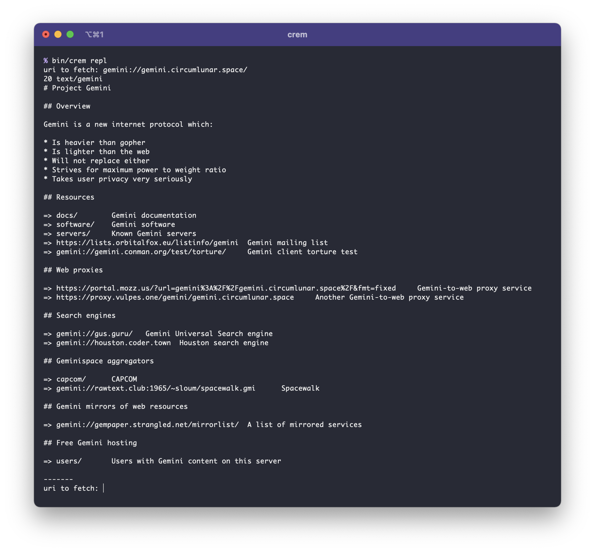

# crem

[x] First, a PoC gemini client.
[ ] Secondly, a PoC gemini server.

## Installation

```
$ git clone https://github.com/Willamin/crem.git
$ cd crem
$ shards build --release

# add bin/crem to your PATH somehow
```

## Usage

```
$ crem repl        # begin a REPL-style barebones Gemini client
```

## Screenshot



## Contributing

1. Fork it (<https://github.com/Willamin/capsule/fork>)
2. Create your feature branch (`git checkout -b my-new-feature`)
3. Commit your changes (`git commit -am 'Add some feature'`)
4. Push to the branch (`git push origin my-new-feature`)
5. Create a new Pull Request

## Contributors

- [Will Lewis](https://github.com/Willamin) - creator and maintainer
